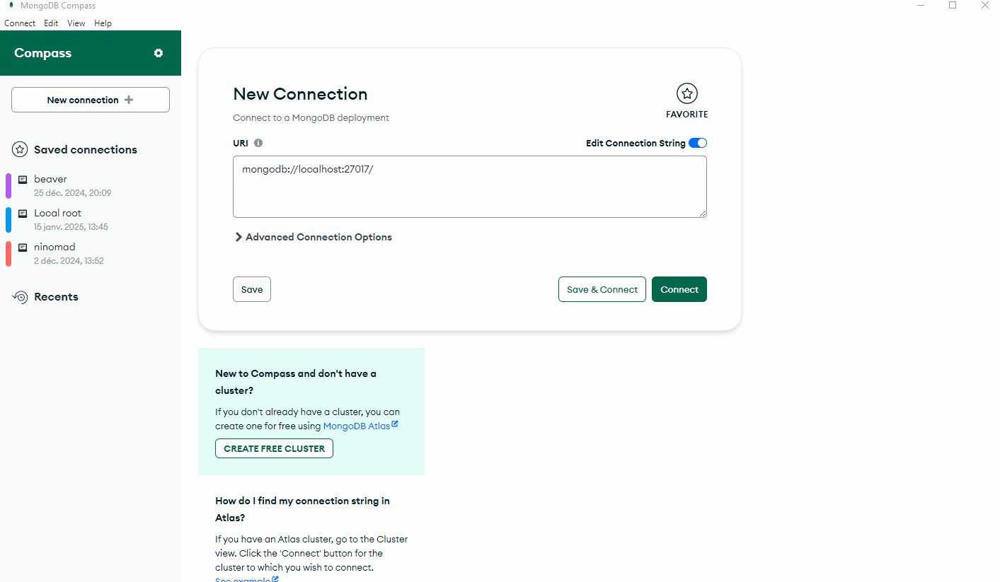

# Activité de requêtage MongoDB

Vous trouverez dans ce dépôt toutes les ressources nécesaires à l'entraînement au requêtage MongoDB.

Les demandes de requêtes à faire sont dans le "README" du dossier "todo".

Pour mettre en place un environnement de développement comprenant une base de données MongoDB plusieurs choix s'offrent à vous :
1. utilisation des fichiers de configuration docker contenu dans ce dépôt
2. installation en local de MongoDB et utilisation d'un client pour créer

En plus d'un SGBD il va vous falloir un client. Dans la suite vous allez vous connecter en utilisant 2 approches distinctes :
1. installation d'un client en ligne de commande
2. installation du client graphique "Mongo Compass"

Ci-dessous des détails concernant l'installation des outils.

## Déploiement d'une base de données locale

> [!CAUTION]
> Choisissez l'une ou l'autre des approches afin d'éviter tout conflit de port.

### Utilisation de Docker

Afin de démarrer un conteneur hébergeant MongoDB lancez là commande suivante à partir de la racine :
```powershell
docker compose up
```

La base de données MongoDB nommée "cinema" et intégrant la collection "films" est alors accesible.

### Installation locale 

Vous pouvez installer un serveur local MongoDB en utilisant Winget sous Windows. Voici la commande à effectuer dans un terminal :
```powershell
winget install -e --id MongoDB.Server
```

Une fois l'installation terminée le sreveur se lance automatiquement et écoute sur le port par défaut `27017`.

Il est possible de constater le bon fonctionnement de la base de données en consultant la fenêtre de services de Windows :


> [!CAUTION]
> Par défaut avec l'installation locale la connexion à la base de données est **non sécurisée** (pas besoin de mot de passe).
>
> Il est conseillé de créer un utilisateur par la suite.

## Installation de client

### Client en ligne de commande

Le Mongo Shell aussi nommé Mongosh peut être installé en utilisant la commande Winget suivante :
```powershell
winget install -e --id MongoDB.Shell
```

> [!TIP]
> Veillez à bien relancer un nouveau terminal après toute installation de logiciel.

Mongosh vous permettra de vous connecter à la base de données en utilisant la commande (cas de la connexion avec mot de passe):
```powershell
mongosh --port 27017 -u "root" -p "root"
```

Si votre serveur de base de données n'est pas configuré pour accepter les connexion sans utilisateur la commande est la suivante :
```powershell
mongosh --port 27017
```

> [!IMPORTANT]
> Essayez de vos connecter en ligne de commande avec Mongosh.
> Une fois la connexion établie :
> - connectez vous à la base de données "cinema" : `use cinema`
> - créez une collection de test : `db.createCollection("test")`

### Client graphique 

Le client graphique Mongo Compass peut être installé en utilisant la commande suivante :
```powerhsell
winget install -e --id MongoDB.Compass.Community
```


Pour se connecter au SGBD en utilisant Compass suivez les indication données le GIF ci-dessous :



> [!CAUTION]
> Dans le cas de l'utilisation de Docker il vous faudra vous connecter avec l'utilisateur "root".
>
> Utilisateur : root
>
> Mot de passe : root

## Travail à effectuer 

Rendez-vous sur le "README" contenu dans le dossier "TODO" pour avoir les requêtes à écrire une fois votre installation fonctionnelle.