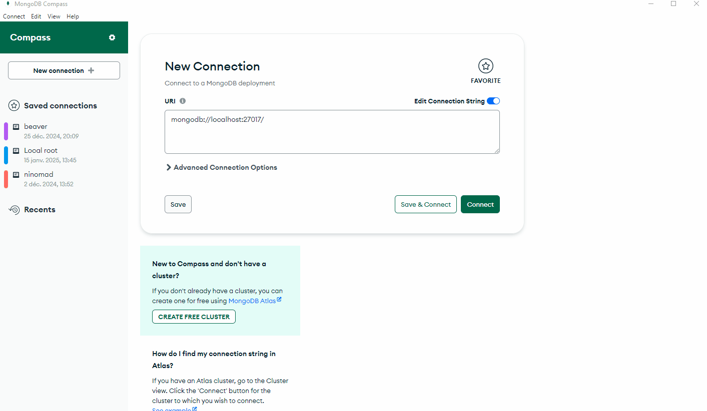
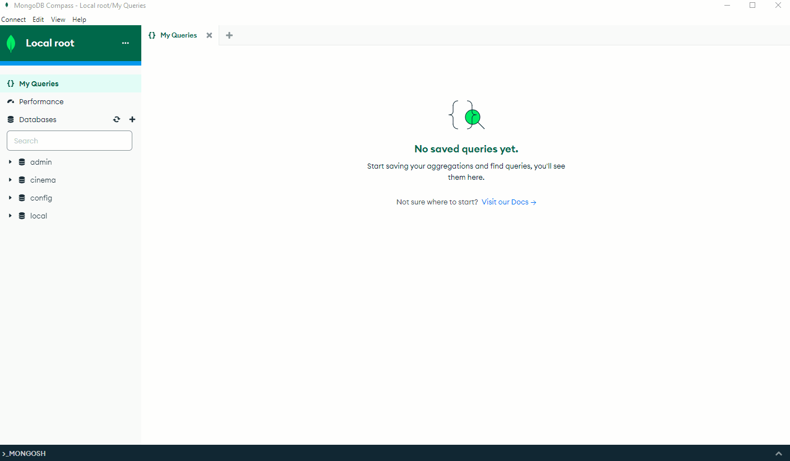

# Ecriture de requêtes MongoDB

Il vous est demandé d'écrire le code permettant de requêter une base de données MongoDB.
Pour se faire vous pourrez utiliser le client graphique **Mongo Compass** et/ou **Mongosh**.

Le fichier "films.json" de ce dépôt contient les **documents** à insérer dans une collection **movies**.

Si vous avez démarré votre base de données en utilisant **Docker cette collection est déjà crée**.

Si vous avez une base de données vierge (installation local de MongoDB) il vous faudra :
1. créer la base de données `cinema`
2. créer une collection `movies`
3. charger les documents dans la collection `movies` grâce au fichier `movies.json`

Le GIF suivant présente la manière de faire avec un SGBD vierge :


Une fois votre base de données en place, vous pourrez commencer la série de requêtes.
Mongo Compass propose deux modes de fonctionnement :
1. une console inspirée de Mongosh
2. des composants graphiques facilitant le requêtage

La console Compass est accessible de la façon suivante :




## Série de requêtes

1. Afficher tous les titres de films de "Spielberg" et du genre "Aventure".

<details>
    <summary>Indice</summary>
  Pour rappel, la méthode `find` prend deux paramètres 
    ```javascript
    db.<nom-collection>.find(<query>, <projection>)
    ```
    - query : restriction sur les valeurs des documents
    - projection : permet de choisir ce que l'on souhaite sélectionner

    Voici un code à compléter :
    ```javascript
    db.movies.find({ genre : ???, director.last_name: "????" }, { title: ??? })
    ```
</details>

2. Afficher tous les titres des films parus en 2000.

> [!TIP]
> Indice
> Pour rappel, la méthode `find` prend deux paramètres 
>   ```javascript
>       db.<nom-collection>.find(<query>, <projection>)
>   ```
>
> - query : restriction sur les valeurs des documents
> - projection : permet de choisir ce que l'on souhaite sélectionner
>
> Voici un code à compléter :
> ```javascript
>   db.movies.find({ year : ??? }, { title: ??? })
> ```

</details>

3. Afficher tous les titres des films du genre "Action".

4. Afficher la liste de tous les "genres" de la collection **sans doublon**.

> [!TIP]
> Indice
>   Inspirez vous de la méthode [distinct](https://www.mongodb.com/docs/manual/reference/method/db.collection.distinct/)
>
>  Voici un code à compléter :
>   ```javascript
>       db.movies.distinct(????)
>   ```

5. Afficher les titres des films français et leur date de sortie.

6. Afficher les titres des films et leur année de sortie dans lesquels "Uma Thurman" a joué.

7. Afficher le nom complet du réalisateur du film "Memento" ?

8. Afficher les noms et prénoms des acteurs qui ont joué dans "Apocalypse Now".

9. Afficher les titres des films sorties entre 1968 et 1978 inclus.

10. Afficher les titres ainsi que l'année de sortie des films sorties avant l'année 1968 comprise (la même question mais année 1968 non comprise).

11. La même question que la précédente mais en triant la sortie par années croissantes, par années décroissantes. Enfin, vous n'afficherez cette fois que 5 lignes.

12. Afficher tous les titres de films du genre "Action" ou "Aventure" ordonnés par genre.

13. Afficher tous les titres de film dont le réalisateur n'est pas "Tarantino".

14. Afficher le nombre de films par genre en utilisant ici l'agrégation et les opérateurs $group (équivalent du "Group By" en SQL) et $sum (équivalent du "SUM" en SQL).

Vous pourrez aussi utiliser l'interface proposée par MongoDB Compass pour composer cette requête d'agrégation.

15. Compter le nombre de documents qui composent cette collection et pour lesquels l'année de sortie du film est supérieure ou égale à l'année 2000.
Vous pourrez vous intéresser à la fonction `countDocuments()`.

16. Afficher le titre et l'année de sortie du films de la collection dont le résumé contient la chaîne de caractères : "la guerre du Vietnam".

17. Afficher les titres et l'année de sortie des films de la collection dans lesquels jouait l'acteur "Robert Redford".

18. Afficher uniquement les titres des films de la collection dont le champ "summary" contient la chaîne de caractères "famille ".
Vous pourrez utiliser ici l'opérateur `$regex`.

19. Modifier l'année de sortie du Film "La Guerre des étoiles" en 1978 au lieu de 1977.

20. Écrire dans la console de MongoDB Compass un programme JavaScript qui permet d'afficher la liste des titres de films dans lesquels joue l'acteur "Clint Eastwood".

> [!TIP]
> Résultat attendu :
> ```
> - Impitoyable
> - Le bon, la Brute et le Truand
> - The Bridges of Madison County
> ```

<details>
  <summary>Indice</summary>
Vous pouvez déclarer et définir une variable JavaScript qui permet de récupérer l'ensemble des films :

```javascript
let recordset = ?????;
while (recordset.hasNext()) {
    let film = recordset.next();
    print( "– " + film.title);
}
```
</details>

21. Écrire dans la console de MongoDB Compass une instruction utilisant le curseur `forEach()` et qui permet d'afficher tous les titres des films du genre "Science-Fiction" avec un compteur de ligne.

> [!TIP]
> Résultat attendu :
> ```
> 1. titre du film : Eternal 
> 2. titre du film : 2001 l'Odyssée de l'espace
> 3. titre du film : Blade Runner
> 4. titre du film : E.T. l'extra-terrestre
> 5. titre du film : Rencontres du troisème type
> 6. titre du film : Star-Wars, épisode III - La Revanche des Sith
> 7. titre du film : Prometheus
> 8. titre du film : Star Wars, épisode IX
> 9. titre du film : Blade Runner 2049
> ```

### Insertion de données

22. Insérer le Film "Pixels" sortie en salle en 2005, c'est une Comédie US réalisée par Chris Columbus.

23. Ajouter l'actrice "Diane Keaton" née en 1946 au film "Le Parrain"
Vous pourrez explorer une solution en utilisant l’opérateur `$push` en ligne de commande.
Puis vous essayerez d'ajouter un acteur supplémentaire en utilisant l'interface graphique proposée par Compass.

> [!CAUTION]
> Il n'y a pas de contrôle d'intégrité des données avec MongoDB, ainsi on pourrait rajouter autant de fois que
> l'on souhaite l'actrice "Diane Keaton"
> Si on veut avoir un contrôle des doublons on peut utiliser l’opérateur `$addToSet` à la place de $push.

24. Ajouter en une seule fois les 2 acteurs "John Cazale" né en 1935 et "Richard Conte" né en 1910 au film "Le Parrain". Pour cela vous devrez utiliser l’opérateur `$each` en ligne de commande.

### Suppression de données

25. Supprimer le film "Impitoyable" de la collection.

26. Supprimer tous les films de l'année 1970.

### Modification de données

27. Modifier le libellé des films du genre "Science Fiction" par "Science-Fiction".

### Dump de base de données

28. Faire un dump de la base de données (fichier JSON) en utilisant MongoDB Compass, puis en utilisant la ligne de commande (Powershell).

<details>
  <summary>Indice</summary>
  Pour exporter les données en utilisant Compass : [Procédure export Compass](https://www.mongodb.com/docs/compass/current/import-export/)

  En ce qui concerne la ligne de commande, regardez du côté de `mongodump` : [Documentation mongodump](https://www.mongodb.com/docs/database-tools/mongodump/)
</details>

### Les jointures en MongoDB

#### Création d'une nouvelle collection

En NoSQL il est possible de joindre les documents de plusieurs collection (même fonctionnement qu'avec une clé étrangère).

Il vous est proposé de créer une nouvelle collection "exploitation" permettant de stocker les revenus des films suivant le pays d'exploitation (aussi appelé "box-office").

Voici un apperçu de cette nouvelle collection, les films de cet exemple sont : "Ben-Hur", "E.T. l’extra-terrestre", "Mars Attacks !", "Blade Runner", "Predator.

| film_id | box_office_fr | box_office_us |
|---|---|---|
| 665 | 13850000 | 98000000 |
| 601 | 9420000 | 140000000 |
| 75 | 2150000 | 100000000 |
| 78 | 2130000 | 95000000 |
| 106 | 1500000 | 120000000 |

Marche à suivre :
1. créer une collection "exploitation"
2. insérer les documents en utilisant la méthode `insertOne()`

Pour le film "Ben-Hur" la requête est la suivante :
```javascript
db.exploitation.insertOne({"box_office_fr" : 13850000, "box_office_us" : 98000000, "film_id" : "movie:665"});
```

3. faire la même chose pour les autres films

#### Requêtage avec les jointures 

Afin de tester les « jointures » avec MongoDB, vous devrez créer une agrégation en formant votre "Pipeline" avec les opérateurs qui suivent : `$lookup` et `$project`.

1. Afficher le titre des films ainsi que le nombre d’entrées au box-office français pour les films concernés par cette jointure.
Vous devrez chercher de la documentation sur l’opérateur `$lookup`.

2. Afficher la somme des entrées au Box-Office Français des films suivant le pays d’origine de leur production.